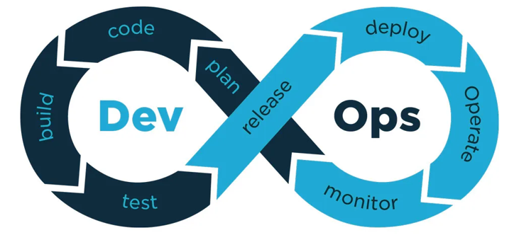
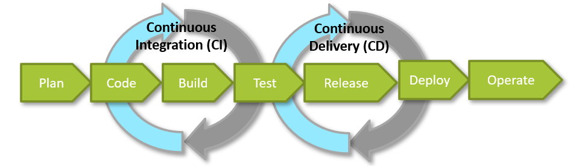
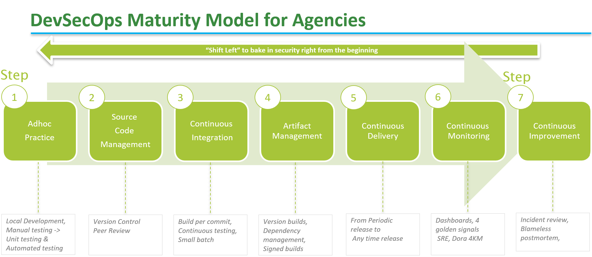
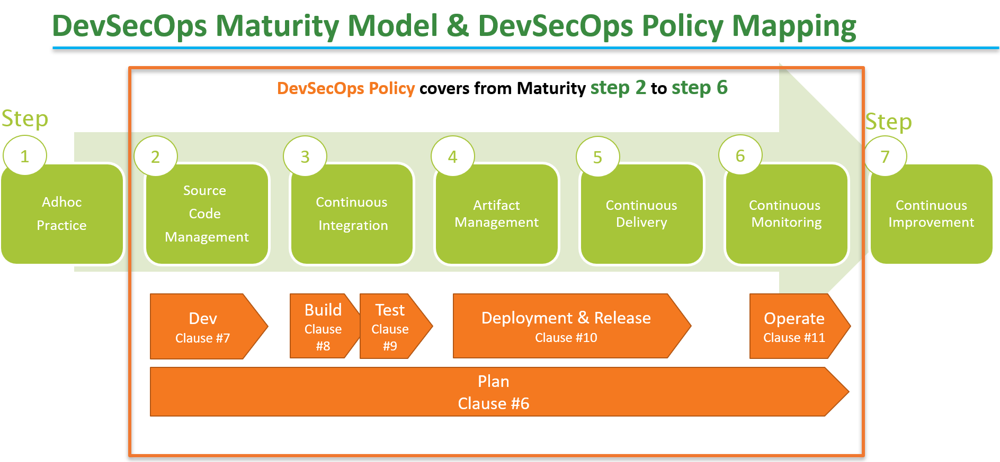
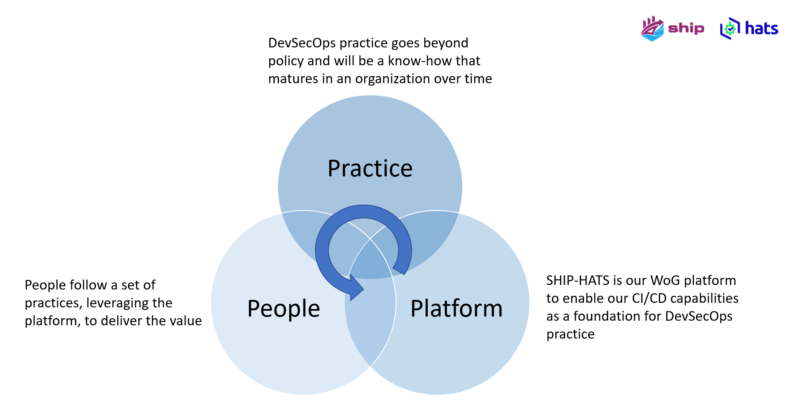

## Overview

### Understanding DevOps

DevOps is a cultural and professional movement that stresses **communication, collaboration** and **integration between software developers and IT operations professionals** while **automating** the process of software delivery and infrastructure changes.

To better understand the DevOps culture, you can also refer to <a href="https://gccprod-my.sharepoint.com/:b:/g/personal/koh_keng_hun_tech_gov_sg/EeH7x96f2L5HifWjEuawt3IBBnFmDC40cu5C2l9wgl7QFA?e=aMIBMd">CAMS model</a> developed by Damon Edwards and John Willis, authors of the famous Podcast DevOps Cafe.CAMS stands for Culture, Automation, Measurement and Sharing. These are all important principles in implementing DevOps.

### Introducing DevSecOps

If DevOps entails automation and collaboration of Development (Dev) and Operations (Ops) processes,DevSecOps goes a step further - driving the adoption of Security (Sec) measures. The collaboration between Dev and Ops is a more natural one, whereas Dev and Sec teams typically had contending objectives. Development is geared towards being agile and executing frequent releases, while Security with its auditing and vulnerabilities tracking by nature, inadvertently holds back development.

So how do we accelerate without compromising on security guard rails?

Incorporate security right from the beginning in the DevOps journey. When security is not part of DevOps, it loses transparency in the production cycle.

Hence, we have a three-way hybrid called DevSecOps which inserts security into the DevOps team, and hands over responsibility for the automation of security tools and their integration into the Software Development Life Cycle (SDLC).

### Elements of DevSecOps - Continuous Integration &amp; Continuous Delivery

The two important elements in DevSecOps are - Continuous Integration &amp; Continuous Delivery.

**Continuous Integration (CI)** – A software engineering approach where developers merge the code into a shared code repository frequently and then verified by automated build and testing.

**Continuous Delivery (CD)** – Produce software changes in short cycles, where the software is kept in releasable state and can be released on demand.

This playbook will share more practical best practices on CI/CD.

### Maturity Model for Agencies

This is a natural progression model in DevSecOps maturity. Every agency is different and the pace of implementing DevSecOps also varies. This model serves to guide agencies to navigate up the maturity model depending on their current state.

### Maturity Model &amp; DevSecOps Policy

You can see how DevSecOps sub-domains map with the DevSecOps maturity model. For example, Development sub-domain is mapped to the Source Code Management while Build &amp; Test sub-domain is related to the Continuous Integration and so forth.

### Playbook Structure

**Note:** There are some hyperlinks to the intranet, and these are meant only for Singapore Government Public Officers.

Now that you have seen the base concepts, let&#39;s look at how this playbook is structured. The chapters are directly aligned with the [IM8 DevSecOps policy](https://intranet.mof.gov.sg/portal/IM/Themes/IT-Management/Security/Topics/Application-Development-Security.aspx) under Application Development Security and offers practical recommendations on how to adopt the policy from clause 6.1 -10.1. We will be indicating the clauses relevant to that section [# Clause Reference number]

# Stage 1: Planning

## When should DevSecOps be adopted?

As per clause 6.1/G1, agencies should consider adopting DevSecOps to:

1. Perform frequent changes (such as quarterly) to the system and regular releases to meet user&#39;s needs. 
2. Deliver the system&#39;s features, bug fixes or enhancements faster through CI/CD. 
3. Improve quality and security of the system through &quot;shift-left&quot; practices and automated testing. 
4. Remove silos and improve the collaboration between the development and operations teams. 

DevSecOps may not be relevant for

- Applications that have been rolled out and is in maintenance mode with minimal change
- Commercially Off the Shelf (COTS) or Software as A Service (SaaS) tools without any coding

## Preparing for adoption

Agencies planning to adopt DevSecOps can look at the 3P – Practice, People, Platform – model shown below to achieve success.

### Platform

Agencies should consider using the central Whole-of-Government (WOG) CI/CD toolchain in Singapore Government Tech Stack (SGTS) such as SHIP-HATS as DevSecOps policy has been co-developed with the central tech stack. If an agency is planning to set up their own platform, they might want to look at the [pricing analysis](https://sgdcs.sgnet.gov.sg/sites/IDA-GoSync/gdspdd-ai/ship/_layouts/15/WopiFrame2.aspx?sourcedoc=%7BACB6DFA8-2433-48B8-9A24-BABA8688B0F6%7D&amp;file=SHIP-HATS%20Competitive%20Pricing%20Assessment.pdf&amp;action=default&amp;IsList=1&amp;ListId=%7B609D81FE-D9DB-4B7D-8D1A-1F02CD38880C%7D&amp;ListItemId=80) that the SHIP-HATS team has prepared for comparison.

### Practice

This playbook will be outlining the necessary and relevant DevSecOps practices and it will also highlight the clauses that agency can fulfil.

### People

People are an important asset, and agency should ensure that the team is equipped with relevant skillsets in terms of automations, system and application security knowledge and an agile mindset. This is not just for practitioners; it extends to Agency leaders and business users so they can get the best out of it.

The table below defines some key roles and responsibilities for the team to consider. Do note that the list is not exhaustive. The development team can also double hat to perform multiple roles, especially for a small development team. For example, the same person can play either:

  - QA and Automation engineer roles; or
  - System and Application security engineer roles

However, agency needs to ensure there is no conflict of interest, that is the developer who wrote the code can't assign themselves as the reviewer.

| **Role** | **Responsibility** |
| :--- | --- |
| Release Manager | <ul><li> Defines security gate requirements and ensures these requirements have been met before any release.</li> <li>Plans and manages release activities and release cycles for the system to handle risks and to pre-empt any issues that may impact release scope, schedule and quality.</li>  <li> Coordinates release content and manages effort for the service request backlog, pending service requests, third-party applications, or operating system updates, deployment plans and checklists execution.</li> <li>Manages release repositories and key information such as build and release procedures, dependencies and notification list to coordinate work across teams.</li> <li> Makes continuous improvements in the release process and works with the development team to understand impacts of code branching and merging to ensure alignment across development team.</li></ul> |
| QA Engineer | <ul><li>Creates, executes and maintains automated test strategies and test cases/scripts.</li> <li> Ensures all environments required for testing are standardised and automated where possible.</li> <li>Performs periodic review of the automated test script/test cases results and provides assessment for the quality of all builds produced by the CI/CD pipeline.</li> <li>Continuously improving testing processes, test efficiency and techniques around test automation and integration with CI/CD pipeline.</li></ul> |
| Automation Engineer | <ul><li> Develops scripts and sets up necessary automation tools used to build, integrate, and deploy software releases to various platforms, including development and production environments.</li> <li>Automates the configuration management of development, quality assurance, and production workloads as well as the automation of CI of the codebase and the CD of releases.</li> <li>Designs, builds, optimises and monitors the automation systems solutions to identify system bottlenecks, production issues to maximise service availability.</li>  <li>Builds automation framework for deployment, management, monitoring of applications, as well as maintains the configuration and deployment tools to auto-scale the application platform.</li></ul>|
| System Security Engineer | <ul><li>Plans, implements, monitors and manages the overall system security architecture.</li> <li> Performs threat and risk assessments and applies secure configuration profiles to their systems.</li>  <li> Performs security checks such as infra level VA and troubleshooting.</li>  <li> Employs best practices when implementing security controls within an information system. </li></ul>|
| Application Security Engineer | <ul><li>Plans, implements and manages the overall application security architecture. <li> Performs application threat modelling on their applications</li> <li> Implements and executes automated SCA, SAST and DAST for applications</li> <li> Performs triage on application security findings</li> <li>Performs penetration testing on the applications </li></ul> |

## Outsourcing Agile Projects

When outsourcing an agile project, do use the [Agile Tender template](https://sgdcs.sgnet.gov.sg/sites/tech/SNDigiGov/Programmes/GovICTProcRes/Pages/BulkTenders/ICTContractTemplates/STANDARD-IT-CONTRACT-TEMPLATE-FOR-PROVISION-OF-AGILEAPPLICATION-MAINTENANCE.aspx) to ensure the requirements and deliverables are written to match agile development. If you are choosing SHIP-HATS as your platform, here is an [AOR template](https://sgdcs.sgnet.gov.sg/sites/IDA-GoSync/gdspdd-ai/ship/_layouts/15/WopiFrame2.aspx?sourcedoc=%7B3F0806F6-0663-4D25-B670-120B87806C49%7D&amp;file=Sample%20AOR%20for%20SHIP-HATS%20Subscription%20(140621).pdf&amp;action=default&amp;IsList=1&amp;ListId=%7B609D81FE-D9DB-4B7D-8D1A-1F02CD38880C%7D&amp;ListItemId=88) that you can include for budget approval.

# Stage 2: Development (Code)

In this section we will share DevSecOps best practices and guidelines for the development phase. The 2 key areas are:

1. Source Code Management [#7.1, #8.1/G4]
2. Coding Practices [#7.2]

## Source Code Management

## Why is source code management important?

Source code management1 (SCM) ensures single source of truth and efficient collaboration with developers. In the government context, it is important for agencies to be able to view the development code changes to **identify any vulnerabilities early on** , even when the project is outsourced. It is highly encouraged to manage the source code in a central repo such as the one hosted by [SHIP-HATS](https://www.developer.tech.gov.sg/singapore-government-tech-stack/toolchain/overview.html) in SGTS so that the Agency has **access to code base anytime**.

If vendors are unable to use the centrally managed code repo in SGTS for any of the existing outsourced projects, they should either allow the agency access to the vendor-managed code repository, or periodically synchronise (like end of each sprint) their code repo to the centrally managed one that the agency has access to.

<i>[1] Source Code Management Mandate - All new and existing GovTech owned systems shall adopt SHIP-HATS for source code management by October FY22 and this was approved by GovTech IDSC in May 2021.</i>

## Version control [#7.1/S1]

Every commit in the code repository that is released to production must be tagged with the version number and should have the supporting logs or commit history, so it is easy to see the changes that were released to production.

Version controlling should also be implemented not just for application codes, but also for:

- Automated test scripts or test cases.
- Scripts such as installation/build/deployment scripts, rollback scripts, migration scripts and CI/CD pipeline scripts.
- Infrastructure as Code (IaC) definitions, Application configurations including prerequisite software details and versions, database details, network details.
- Environment configurations including default settings.
- Project documentations or Standard Operating Procedure (SOP) that require review and/or approval. A good example is the Architecture Decision Record (ADR) - a simple and lightweight method to document any technical and architectural decisions and changes made. You can refer to this [Medium article](https://betterprogramming.pub/here-is-a-simple-yet-powerful-tool-to-record-your-architectural-decisions-5fb31367a7da) to find out how to use ADR, and their [GitHub](https://adr.github.io/) page for more tooling and templates.

## Code Merge [#7.1/S2, #8.1/G3]

**Short-lived branches**

Agencies should check in working source code to a short-lived branch at least once per day and merge to the main repository branch by a pull request at most after a couple of days to keep batch size small and detect merge problems faster.

To use short-lived branches, reduce the user stories into bite-sized tasks or subtasks that can be completed withing a day or two. This will also help to ensure that the pull requests can be reviewed and merged quickly. It is best to submit pull request as and when the code is ready and need not wait until the end of the sprint.

**Pull request to merge**

The production or release trunk should be protected, and code can only be merged to the protected trunk through pull requests.

Note to know more about release trunk, refer to [Understanding DevOps](#understanding-devops).

**Implementing peer reviews**

Peer review all pull requests and approve them before merging into the trunk. Do take note that a self-review of the pull request should not be accepted.

The main objective is to validate the correctness of the code and making sure that the changes implemented are aligned with the story or ticket that it is tagged to. If the reviewer can think of better ways of implementing the change, the reviewer can also make suggestions to improve the code. Once the code has been reviewed, the reviewer approves the changes and merge the changes into the trunk.

**Peer review guidelines**

- A peer reviewer can be another developer in the project, who understands the code base.
- The team should come together to discuss the code architecture and how their features may affect other parts prior to reviewing the code.
- There can be more than one reviewer, and the code review can be done online or offline.
- The batch size should be small to make the review less tedious. The developer can separate the code changes into logical sections (for example: frontend and backend) or separate them based on the tasks and subtasks in the ticket and submit multiple small pull requests for review.
- Review should include the changes in the tests such as what are new tests added or removed.
- Leverage on pull request to enable peer review of the code instead of pushing directly through to the trunk.
- The submitted pull request should pass all automated tests such as unit tests and builds in the CI pipeline before the reviewer can approve and merge the changes into trunk. Fix any failure in the CI pipeline before the pull request can be approved and merged.
- If there is any failure, notify the developer about the corrections to be made. Configure messaging apps to receive notifications so that developers get alerted. Examples of such notifications are automated tests fail, build failed or completed successfully, change in pull requests status such as created, merged, canceled or reviewer(s) adding comments for the code review.

## Coding Practices

### Style Guide

At the start of the project, the team should agree on a coding style guide. The style guide could contain recommendations on crisp and clear commenting &amp; documentation, consistent indentation, code grouping, consistent naming convention, as well as file &amp; folder organization for the application. A linter and formatter should be set up within the Integrated Development Environment (IDE) so that the agreed-upon style will be automatically applied to any code developed. Having a consistent style of code in the application will allow quicker and easier development, and the linter can even help to detect problems or bugs/vulnerabilities in the code. Logs for the application should also follow a fixed format/style so that it is easier for tools to parse and interpret the logs.

### Code "Smells"

Code smells refer to any characteristics in the source codes of a program that possibly indicates a deeper problem. To ensure the source codes are clean and maintainable (or free of &quot;smell&quot;), developers can find and integrate code &quot;smells&quot; plugins for their IDE, which helps to perform code &quot;smells&quot; automatically. One such example of a plugin would be the SonarLint IDE extension provided by SonarQube available within SHIP-HATS.

### Secure Coding Practices

Practicing secure coding reduces vulnerabilities and bugs in the application. There are many comprehensive guides out there and one of highly recommended guides is the [Secure Coding Practices Guide at OWASP.](https://owasp.org/www-pdf-archive/OWASP_SCP_Quick_Reference_Guide_v2.pdf)

Below are some important secure coding practices that agencies are encouraged to incorporate. Do note that this list is not exhaustive:

**Input validation**

- Validate all input data from clients such as parameters, headers, URLs.
- Validate the data types, data range, length, or use regex – regular expression - for each data input.
- Whenever possible, implement whitelisting over blacklisting.

**Authentication and password management**

- It is highly encouraged to use a central authentication service such as Singpass or Corppass, available on SGTS, instead of implementing a proprietary one.
- When the agencies can&#39;t use the central authentication services, at the very least, they should make sure the passwords are stored as cryptographically strong one-way salted hashes, to a table that can only be readable/writable by the application
- It is recommended to implement password complexity/length/non-reuse/expiry best practices.
- Disable the account if the login attempt fails for 10 times consecutively.

**Session management**

- Generate new session identifier for each authentication and implement session expiry and inactivity timeout suitable for the application.
- Do not allow concurrent logins with the same user account and revoke any of the previous sessions unless there is a business requirement to have concurrent logins.

**Access control**

- Periodically audit accounts and disable the inactive accounts and revoke the session identifiers.
- Enable proper access control to all restricted resources by authorised users, use a default deny approach to the restricted resources.

**Error handling and logging**

Errors are often an indication of bugs in the system that may lead-up future vulnerabilities.

- Address all errors and exceptions. There could also be a global exception situated at the top level of the code to catch any stray exceptions.
- Do not display debugging, stack trace or sensitive information in error responses.
- Do not store sensitive information in logs and restrict log access to only authorised individuals.
- Log errors with appropriate details for diagnosis and future mitigation.
- Store error logs on trusted systems.

**System configuration**

- Remove unnecessary system information in HTTP response headers.
- Remove any test code or any functionality not intended for production during deployment.
- Maintain separate configuration files for separate environments.
- Do not keep any secrets or sensitive information in your config files. Keep them in a secrets management service such as AWS Secrets Manager.

**Database security**

- Use strongly typed parameterised queries.
- Ensure application uses the lowest level of privilege when accessing the database.
- Ensure applications use different credentials for different trust distinctions. For example, user, read-only user and administrator.

**File management**

- When uploading files, limit file types by checking the file headers (checking file extensions is not adequate).
- Turn off execution privileges on file upload directories.
- Scan user uploaded files for viruses and malware.

### Unit testing

A unit is the smallest testable part of an application, and unit testing should be written to ensure that unit is meeting its intended design and behaviors. Developers should use a code coverage metric (both line coverage and branch coverage) to assist when writing unit tests. Aim to have a high code coverage like 85% and above but note that achieving 100% coverage might not necessarily mean that all possible test cases have been covered. For example, a code branch that has multiple conditions will report 100% line and branch coverage, if one of the conditions was covered in the unit tests. However, tests should still be written for the remaining conditions as well.

### Code refactoring

Code refactoring is the process of restructuring code without any modifications to external behavior to improve code consistency and make it simple for future developments.

**When to refactor?**

Refactoring can be done during code review to clean up the current code before the system goes live as well as at regular intervals to clean up low-hanging bugs, to remove duplicate codes, or simplify conditional expressions.

Tips for refactoring

- Remove unnecessary code such as unused references or functions and test cases.
- Extract duplicate code into common functions ([Rule of Three](https://en.wikipedia.org/wiki/Rule_of_three_(computer_programming))).
- If functions or code have high complexity, consider breaking them down into smaller functions, modules or files.

### Software Frameworks

Choose software frameworks for your programming language with the following suggested guidelines:

- The framework is actively maintained
- Use the stable release version of the framework when compared to beta or pre-release versions
- Issues/bugs identified by users or security vulnerabilities that were discovered are frequently patched or fixed by the contributors
- The framework should already have inbuilt security features that will help make your application more secure. For example, automatic CSRF protection and SQL injection protection.
- The framework is an open source and the code is accessible for review.
- Take note of the software license for the framework. Make sure it is appropriate for your project and can be used in accordance with their license policy.

### Other practices to consider

**Pair Programming**

Pair programming is an [agile software development](https://en.wikipedia.org/wiki/Agile_software_development) technique in which two software engineers work together at one workstation. One, the driver, writes [code](https://en.wikipedia.org/wiki/Source_code) while the other, the observer or navigator, [reviews](https://en.wikipedia.org/wiki/Code_review) each line of code as it is typed in. The two programmers switch roles frequently.

While reviewing, the observer also considers the &quot;strategic&quot; direction of the work, coming up with ideas for improvements and likely future problems to address. The driver can focus on execution details and the &quot;tactical&quot; aspects of the current task, using the observer as a safety net and guide.

**Test Driven Development (TDD)**

Do Test-Driven-Development (TDD) if you can, and you should get a 90%+ code coverage as a bonus. To learn TDD, visit [Scrum.org](https://www.scrum.org/resources/introduction-test-driven-development). Developer should also collaborate with the application security engineer to write automated security unit testing.
