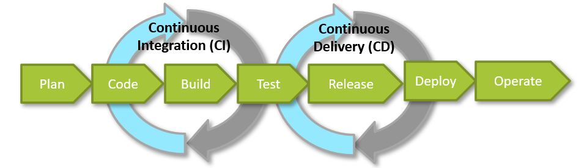
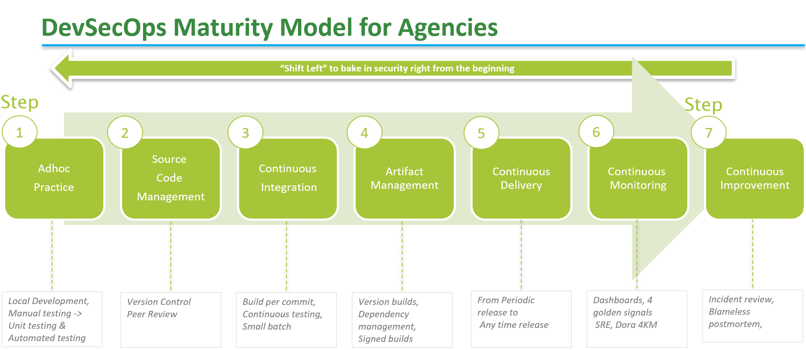

# DevSecOps Playbook

# Overview

## Understanding DevOps
DevOps is a cultural and professional movement that stresses **communication, collaboration** and **integration between software developers and IT operations professionals** while **automating** the process of software delivery and infrastructure changes.

To better understand the DevOps culture, you can also refer to [CAMS model](https://brunodelb.medium.com/the-cams-model-to-better-understand-the-devops-movement-ffe6713c3fd7) developed by Damon Edwards and John Willis, authors of the famous Podcast DevOps Cafe.CAMS stands for Culture, Automation, Measurement and Sharing. These are all important principles in implementing DevOps.

## Introducing DevSecOps

If DevOps entails automation and collaboration of Development (Dev) and Operations (Ops) processes,DevSecOps goes a step further - driving the adoption of Security (Sec) measures. The collaboration between Dev and Ops is a more natural one, whereas Dev and Sec teams typically had contending objectives. Development is geared towards being agile and executing frequent releases, while Security with its auditing and vulnerabilities tracking by nature, inadvertently holds back development.

So how do we accelerate without compromising on security guard rails?

Incorporate security right from the beginning in the DevOps journey. When security is not part of DevOps, it loses transparency in the production cycle.

Hence, we have a three-way hybrid called DevSecOps which inserts security into the DevOps team, and hands over responsibility for the automation of security tools and their integration into the Software Development Life Cycle (SDLC).

## Elements of DevSecOps - Continuous Integration &amp; Continuous Delivery

The two important elements in DevSecOps are - Continuous Integration &amp; Continuous Delivery.

**Continuous Integration (CI)** – A software engineering approach where developers merge the code into a shared code repository frequently and then verified by automated build and testing.

**Continuous Delivery (CD)** – Produce software changes in short cycles, where the software is kept in releasable state and can be released on demand.

This playbook will share more practical best practices on CI/CD.

## Maturity Model for Agencies

This is a natural progression model in DevSecOps maturity. Every agency is different and the pace of implementing DevSecOps also varies. This model serves to guide agencies to navigate up the maturity model depending on their current state.

## Maturity Model &amp; DevSecOps Policy

You can see how DevSecOps sub-domains map with the DevSecOps maturity model. For example, Development sub-domain is mapped to the Source Code Management while Build &amp; Test sub-domain is related to the Continuous Integration and so forth.

## Playbook Structure

**Note:** There are some hyperlinks to the intranet, and these are meant only for Singapore Government Public Officers.

Now that you have seen the base concepts, let&#39;s look at how this playbook is structured. The chapters are directly aligned with the [IM8 DevSecOps policy](https://intranet.mof.gov.sg/portal/IM/Themes/IT-Management/Security/Topics/Application-Development-Security.aspx) under Application Development Security and offers practical recommendations on how to adopt the policy from clause 6.1 -10.1. We will be indicating the clauses relevant to that section [# Clause Reference number]

# Stage 1: Planning

## When should DevSecOps be adopted?

As per clause 6.1/G1, agencies should consider adopting DevSecOps to:

1. Perform frequent changes (such as quarterly) to the system and regular releases to meet user&#39;s needs. 
2. Deliver the system&#39;s features, bug fixes or enhancements faster through CI/CD. 
3. Improve quality and security of the system through &quot;shift-left&quot; practices and automated testing. 
4. Remove silos and improve the collaboration between the development and operations teams. 

DevSecOps may not be relevant for

- Applications that have been rolled out and is in maintenance mode with minimal change
- Commercially Off the Shelf (COTS) or Software as A Service (SaaS) tools without any coding

## Preparing for adoption

Agencies planning to adopt DevSecOps can look at the 3P – Practice, People, Platform – model shown below to achieve success.

### Platform

Agencies should consider using the central Whole-of-Government (WOG) CI/CD toolchain in Singapore Government Tech Stack (SGTS) such as SHIP-HATS as DevSecOps policy has been co-developed with the central tech stack. If an agency is planning to set up their own platform, they might want to look at the [pricing analysis](https://sgdcs.sgnet.gov.sg/sites/IDA-GoSync/gdspdd-ai/ship/_layouts/15/WopiFrame2.aspx?sourcedoc=%7BACB6DFA8-2433-48B8-9A24-BABA8688B0F6%7D&amp;file=SHIP-HATS%20Competitive%20Pricing%20Assessment.pdf&amp;action=default&amp;IsList=1&amp;ListId=%7B609D81FE-D9DB-4B7D-8D1A-1F02CD38880C%7D&amp;ListItemId=80) that the SHIP-HATS team has prepared for comparison.

### Practice

This playbook will be outlining the necessary and relevant DevSecOps practices and it will also highlight the clauses that agency can fulfil.

### People

People are an important asset, and agency should ensure that the team is equipped with relevant skillsets in terms of automations, system and application security knowledge and an agile mindset. This is not just for practitioners; it extends to Agency leaders and business users so they can get the best out of it.

The table below defines some key roles and responsibilities for the team to consider. Do note that the list is not exhaustive. The development team can also double hat to perform multiple roles, especially for a small development team. For example, the same person can play either:

  - QA and Automation engineer roles; or
  - System and Application security engineer roles

However, agency needs to ensure there is no conflict of interest, that is the developer who wrote the code can't assign themselves as the reviewer.

| **Role** | **Responsibility** |
| :--- | --- |
| Release Manager | <ul><li> Defines security gate requirements and ensures these requirements have been met before any release.</li> <li>Plans and manages release activities and release cycles for the system to handle risks and to pre-empt any issues that may impact release scope, schedule and quality.</li>  <li> Coordinates release content and manages effort for the service request backlog, pending service requests, third-party applications, or operating system updates, deployment plans and checklists execution.</li> <li>Manages release repositories and key information such as build and release procedures, dependencies and notification list to coordinate work across teams.</li> <li> Makes continuous improvements in the release process and works with the development team to understand impacts of code branching and merging to ensure alignment across development team.</li></ul> |
| QA Engineer | <ul><li>Creates, executes and maintains automated test strategies and test cases/scripts.</li> <li> Ensures all environments required for testing are standardised and automated where possible.</li> <li>Performs periodic review of the automated test script/test cases results and provides assessment for the quality of all builds produced by the CI/CD pipeline.</li> <li>Continuously improving testing processes, test efficiency and techniques around test automation and integration with CI/CD pipeline.</li></ul> |
| Automation Engineer | <ul><li> Develops scripts and sets up necessary automation tools used to build, integrate, and deploy software releases to various platforms, including development and production environments.</li> <li>Automates the configuration management of development, quality assurance, and production workloads as well as the automation of CI of the codebase and the CD of releases.</li> <li>Designs, builds, optimises and monitors the automation systems solutions to identify system bottlenecks, production issues to maximise service availability.</li>  <li>Builds automation framework for deployment, management, monitoring of applications, as well as maintains the configuration and deployment tools to auto-scale the application platform.</li></ul>|
| System Security Engineer | <ul><li>Plans, implements, monitors and manages the overall system security architecture.</li> <li> Performs threat and risk assessments and applies secure configuration profiles to their systems.</li>  <li> Performs security checks such as infra level VA and troubleshooting.</li>  <li> Employs best practices when implementing security controls within an information system. </li></ul>|
| Application Security Engineer | <ul><li>Plans, implements and manages the overall application security architecture. <li> Performs application threat modelling on their applications</li> <li> Confirms all security testing tools must be updated to its latest security checklists before scanning code packages, application and infrastructure components</li> <li> Implements and executes automated SCA, SAST and DAST for applications</li> <li> Performs triage on application security findings</li> <li>Performs penetration testing on the applications </li></ul> |

## Outsourcing Agile Projects

When outsourcing an agile project, do use the [Agile Tender template](https://sgdcs.sgnet.gov.sg/sites/tech/SNDigiGov/Programmes/GovICTProcRes/Pages/BulkTenders/ICTContractTemplates/STANDARD-IT-CONTRACT-TEMPLATE-FOR-PROVISION-OF-AGILEAPPLICATION-MAINTENANCE.aspx) to ensure the requirements and deliverables are written to match agile development. If you are choosing SHIP-HATS as your platform, here is an [AOR template](https://sgdcs.sgnet.gov.sg/sites/IDA-GoSync/gdspdd-ai/ship/_layouts/15/WopiFrame2.aspx?sourcedoc=%7B3F0806F6-0663-4D25-B670-120B87806C49%7D&amp;file=Sample%20AOR%20for%20SHIP-HATS%20Subscription%20(140621).pdf&amp;action=default&amp;IsList=1&amp;ListId=%7B609D81FE-D9DB-4B7D-8D1A-1F02CD38880C%7D&amp;ListItemId=88) that you can include for budget approval.

# Stage 2: Development (Code)

In this section we will share DevSecOps best practices and guidelines for the development phase. The 2 key areas are:

1. Source Code Management [#7.1, #8.1/G4]
2. Coding Practices [#7.2]

## Source Code Management

## Why is source code management important?

Source code management1 (SCM) ensures single source of truth and efficient collaboration with developers. In the government context, it is important for agencies to be able to view the development code changes to **identify any vulnerabilities early on** , even when the project is outsourced. It is highly encouraged to manage the source code in a central repo such as the one hosted by [SHIP-HATS](https://www.developer.tech.gov.sg/singapore-government-tech-stack/toolchain/overview.html) in SGTS so that the Agency has **access to code base anytime**.

If vendors are unable to use the centrally managed code repo in SGTS for any of the existing outsourced projects, they should either allow the agency access to the vendor-managed code repository, or periodically synchronise (like end of each sprint) their code repo to the centrally managed one that the agency has access to.

<i>[1] Source Code Management Mandate - All new and existing GovTech owned systems shall adopt SHIP-HATS for source code management by October FY22 and this was approved by GovTech IDSC in May 2021.</i>

## Version control [#7.1/S1]

Every commit in the code repository that is released to production must be tagged with the version number and should have the supporting logs or commit history, so it is easy to see the changes that were released to production.

Version controlling should also be implemented not just for application codes, but also for:

- Automated test scripts or test cases.
- Scripts such as installation/build/deployment scripts, rollback scripts, migration scripts and CI/CD pipeline scripts.
- Infrastructure as Code (IaC) definitions, Application configurations including prerequisite software details and versions, database details, network details.
- Environment configurations including default settings.
- Project documentations or Standard Operating Procedure (SOP) that require review and/or approval. A good example is the Architecture Decision Record (ADR) - a simple and lightweight method to document any technical and architectural decisions and changes made. You can refer to this [Medium article](https://betterprogramming.pub/here-is-a-simple-yet-powerful-tool-to-record-your-architectural-decisions-5fb31367a7da) to find out how to use ADR, and their [GitHub](https://adr.github.io/) page for more tooling and templates.

## Code Merge [#7.1/S2, #8.1/G3]

**Short-lived branches**

Agencies should check in working source code to a short-lived branch at least once per day and merge to the main repository branch by a pull request at most after a couple of days to keep batch size small and detect merge problems faster.

To use short-lived branches, reduce the user stories into bite-sized tasks or subtasks that can be completed withing a day or two. This will also help to ensure that the pull requests can be reviewed and merged quickly. It is best to submit pull request as and when the code is ready and need not wait until the end of the sprint.

**Pull request to merge**

The production or release trunk should be protected, and code can only be merged to the protected trunk through pull requests.

Note to know more about release trunk, refer to [Understanding DevOps](#understanding-devops).

**Implementing peer reviews**

Peer review all pull requests and approve them before merging into the trunk. Do take note that a self-review of the pull request should not be accepted.

The main objective is to validate the correctness of the code and making sure that the changes implemented are aligned with the story or ticket that it is tagged to. If the reviewer can think of better ways of implementing the change, the reviewer can also make suggestions to improve the code. Once the code has been reviewed, the reviewer approves the changes and merge the changes into the trunk.

**Peer review guidelines**

- A peer reviewer can be another developer in the project, who understands the code base.
- The team should come together to discuss the code architecture and how their features may affect other parts prior to reviewing the code.
- There can be more than one reviewer, and the code review can be done online or offline.
- The batch size should be small to make the review less tedious. The developer can separate the code changes into logical sections (for example: frontend and backend) or separate them based on the tasks and subtasks in the ticket and submit multiple small pull requests for review.
- Review should include the changes in the tests such as what are new tests added or removed.
- Leverage on pull request to enable peer review of the code instead of pushing directly through to the trunk.
- The submitted pull request should pass all automated tests such as unit tests and builds in the CI pipeline before the reviewer can approve and merge the changes into trunk. Fix any failure in the CI pipeline before the pull request can be approved and merged.
- If there is any failure, notify the developer about the corrections to be made. Configure messaging apps to receive notifications so that developers get alerted. Examples of such notifications are automated tests fail, build failed or completed successfully, change in pull requests status such as created, merged, canceled or reviewer(s) adding comments for the code review.

## Coding Practices

### Style Guide

At the start of the project, the team should agree on a coding style guide. The style guide could contain recommendations on crisp and clear commenting &amp; documentation, consistent indentation, code grouping, consistent naming convention, as well as file &amp; folder organization for the application. A linter and formatter should be set up within the Integrated Development Environment (IDE) so that the agreed-upon style will be automatically applied to any code developed. Having a consistent style of code in the application will allow quicker and easier development, and the linter can even help to detect problems or bugs/vulnerabilities in the code. Logs for the application should also follow a fixed format/style so that it is easier for tools to parse and interpret the logs.

### Code "Smells"

Code smells refer to any characteristics in the source codes of a program that possibly indicates a deeper problem. To ensure the source codes are clean and maintainable (or free of &quot;smell&quot;), developers can find and integrate code &quot;smells&quot; plugins for their IDE, which helps to perform code &quot;smells&quot; automatically. One such example of a plugin would be the SonarLint IDE extension provided by SonarQube available within SHIP-HATS.

### Secure Coding Practices

Practicing secure coding reduces vulnerabilities and bugs in the application. There are many comprehensive guides out there and one of highly recommended guides is the [Secure Coding Practices Guide at OWASP.](https://owasp.org/www-pdf-archive/OWASP_SCP_Quick_Reference_Guide_v2.pdf)

Below are some important secure coding practices that agencies are encouraged to incorporate. Do note that this list is not exhaustive:

**Input validation**

- Validate all input data from clients such as parameters, headers, URLs.
- Validate the data types, data range, length, or use regex – regular expression - for each data input.
- Whenever possible, implement whitelisting over blacklisting.

**Authentication and password management**

- It is highly encouraged to use a central authentication service such as Singpass or Corppass, available on SGTS, instead of implementing a proprietary one.
- When the agencies can&#39;t use the central authentication services, at the very least, they should make sure the passwords are stored as cryptographically strong one-way salted hashes, to a table that can only be readable/writable by the application
- It is recommended to implement password complexity/length/non-reuse/expiry best practices.
- Disable the account if the login attempt fails for 10 times consecutively.

**Session management**

- Generate new session identifier for each authentication and implement session expiry and inactivity timeout suitable for the application.
- Do not allow concurrent logins with the same user account and revoke any of the previous sessions unless there is a business requirement to have concurrent logins.

**Access control**

- Periodically audit accounts and disable the inactive accounts and revoke the session identifiers.
- Enable proper access control to all restricted resources by authorised users, use a default deny approach to the restricted resources.

**Error handling and logging**

Errors are often an indication of bugs in the system that may lead-up future vulnerabilities.

- Address all errors and exceptions. There could also be a global exception situated at the top level of the code to catch any stray exceptions.
- Do not display debugging, stack trace or sensitive information in error responses.
- Do not store sensitive information in logs and restrict log access to only authorised individuals.
- Log errors with appropriate details for diagnosis and future mitigation.
- Store error logs on trusted systems.

**System configuration**

- Remove unnecessary system information in HTTP response headers.
- Remove any test code or any functionality not intended for production during deployment.
- Maintain separate configuration files for separate environments.
- Do not keep any secrets or sensitive information in your config files. Keep them in a secrets management service such as AWS Secrets Manager.

**Database security**

- Use strongly typed parameterised queries.
- Ensure application uses the lowest level of privilege when accessing the database.
- Ensure applications use different credentials for different trust distinctions. For example, user, read-only user and administrator.

**File management**

- When uploading files, limit file types by checking the file headers (checking file extensions is not adequate).
- Turn off execution privileges on file upload directories.
- Scan user uploaded files for viruses and malware.

### Unit testing

A unit is the smallest testable part of an application, and unit testing should be written to ensure that unit is meeting its intended design and behaviors. Developers should use a code coverage metric (both line coverage and branch coverage) to assist when writing unit tests. Aim to have a high code coverage like 85% and above but note that achieving 100% coverage might not necessarily mean that all possible test cases have been covered. For example, a code branch that has multiple conditions will report 100% line and branch coverage, if one of the conditions was covered in the unit tests. However, tests should still be written for the remaining conditions as well.

### Code refactoring

Code refactoring is the process of restructuring code without any modifications to external behavior to improve code consistency and make it simple for future developments.

**When to refactor?**

Refactoring can be done during code review to clean up the current code before the system goes live as well as at regular intervals to clean up low-hanging bugs, to remove duplicate codes, or simplify conditional expressions.

Tips for refactoring

- Remove unnecessary code such as unused references or functions and test cases.
- Extract duplicate code into common functions ([Rule of Three](https://en.wikipedia.org/wiki/Rule_of_three_(computer_programming))).
- If functions or code have high complexity, consider breaking them down into smaller functions, modules or files.

### Software Frameworks

Choose software frameworks for your programming language with the following suggested guidelines:

- The framework is actively maintained
- Use the stable release version of the framework when compared to beta or pre-release versions
- Issues/bugs identified by users or security vulnerabilities that were discovered are frequently patched or fixed by the contributors
- The framework should already have inbuilt security features that will help make your application more secure. For example, automatic CSRF protection and SQL injection protection.
- The framework is an open source and the code is accessible for review.
- Take note of the software license for the framework. Make sure it is appropriate for your project and can be used in accordance with their license policy.

### Third Party or Open Source Libraries

Some suggested guidelines when using third party/open source libraries for your application

- Make sure that the versions of third party or open source libraries or packages are explicitly declared (i.e. version locked). Some package managers such as `npm` for NodeJS offer such capabilities by default, while others such as `pip` for Python require additional configuration or tools.
- When downloading the libraries or packages, it is recommended to use a hosted repository manager such as the one offered in SHIP-HATS. A hosted repository manager helps to cache and speed up downloads, ensures the security of the downloaded packages by verifying checksums and flags out any known vulnerabilities for the libraries.

### Other practices to consider

**Pair Programming**

Pair programming is an [agile software development](https://en.wikipedia.org/wiki/Agile_software_development) technique in which two software engineers work together at one workstation. One, the driver, writes [code](https://en.wikipedia.org/wiki/Source_code) while the other, the observer or navigator, [reviews](https://en.wikipedia.org/wiki/Code_review) each line of code as it is typed in. The two programmers switch roles frequently.

While reviewing, the observer also considers the &quot;strategic&quot; direction of the work, coming up with ideas for improvements and likely future problems to address. The driver can focus on execution details and the &quot;tactical&quot; aspects of the current task, using the observer as a safety net and guide.

**Test Driven Development (TDD)**

Do Test-Driven-Development (TDD) if you can, and you should get a 90%+ code coverage as a bonus. To learn TDD, visit [Scrum.org](https://www.scrum.org/resources/introduction-test-driven-development). Developer should also collaborate with the application security engineer to write automated security unit testing.

# Stage 3 : Building and Packaging

In this section, we will cover the best practices related to building and packaging your application.

The project management tools (such as the ones in SHIP-HATS) discussed in [Stage 1: Planning](https://docs.developer.gov.sg/docs/devsecops-playbook/#/devsecops-playbook?id=stage-1-planning), can help to streamline features tracking and bug fixes that are part of a build.

When developing a feature or fixing a bug, code changes should be tagged to the story card or ticket. For example, while fixing a bug, link the respective ticket ID in the code branch or include it in the title or description of the pull request. This allows the build pipeline to track the changes in the build, and the tickets in the project management tool to track if the pipelines have passed or failed. The pipeline artifacts or results by external tools like SAST scans can be tagged with the ticket ID to link them to the feature/bug.

A CI pipeline should be configured to perform the build based on the feature branches in the repository, or when there is a pull request to merge into a target trunk.

## Automating Pipeline [#8.1/G5, G7]

Configure the CI pipeline to run automatically based on certain triggers. Different portions of the pipeline can be triggered at different times. Examples include:

- Triggering automated unit and integration tests, SAST scans, linting or formatting after every commit so errors can be caught early.
- Triggering slower tests such as UI or end-to-end tests at scheduled timings, such as at the end of each day to avoid impacting the developer's work.
- Triggering automated builds after each pull request has been merged into the main trunk so that the package can be deployed into the QA or UAT environment for testing.

We highly recommend that pipelines are triggered automatically. However, manual triggers are acceptable in certain scenarios, such as to test the configuration of the pipeline itself, or to rerun if something in the pipeline failed.

**Build history:** For audit and tracking purpose, configure the CI pipeline to maintain/keep the execution history and logs for at least one year. By default, CI tools in SHIP-HATS, tracks the history of the pipeline executions. Some CI pipeline tools allow you to save temporary artifacts like test results and log files for each build of the pipeline as well. The CI tools in SHIP-HATS keeps these artifacts for the last 10 builds. These artifacts can also be downloaded and persisted elsewhere for audit and tracking purposes.

## Static Application Security Testing [#8.1/S1, G8, G9]

Static Application Security Testing (SAST) is a testing methodology that analyses source code for vulnerabilities without executing anything and provides feedback early in the development cycle. This helps to reduce the cost of bug fixing. SAST is programming-language dependent.

**When to perform SAST?**

A full SAST scan must be performed on the repositories whenever code is merged into release/production trunk. However, it is recommended to run the full SAST scan at least once a month or in each sprint, especially if the application is not released frequently. After the scan, the results should be reviewed by the team. This is also a good chance for the developers and security engineers to collaborate and discuss [secure coding practices](https://docs.developer.tech.gov.sg/docs/devsecops-playbook/#/devsecops-playbook?id=secure-coding-practices) and learn from each other as they review the scan results.

**Tools** : We highly encourage using SAST tools within SHIP-HATS which have been configured for security standards and here are the [languages and frameworks supported](https://www.microfocus.com/en-us/fortify-languages).

**SAST Triage**

- **Scan Review:** After the scan, the developers and the Application Security Engineer should review the scan results. If there are any false positives in the scan results, the developers should justify why it is a false positive. The Application Security Engineer will make the decision on whether the error can be suppressed and mark it as a false positive.
- **Mitigation:** Minimally, the high and critical issues flagged in the scan results should be mitigated as soon as possible (ideally within the sprint itself). Issues flagged as low or medium can be resolved subsequently when there is available time (See [IM8](https://intranet.mof.gov.sg/portal/IM/Themes/IT-Management/Security/Topics/Application-Development-Security.aspx)(5.1/S3) for timeframe for vulnerability management). In the meantime, risk assessment can be performed for the low and medium risks until they are fixed.
- **Technical Debt:** Because the low and medium severity issues are not resolved immediately, do ensure that time is allocated in the subsequent sprints to address and mitigate the remaining issues.

## Software Composition Analysis [#8.1/S2]

Software Composition Analysis (SCA) scans your application on third-party or open-source software components for any known vulnerabilities. It can work on both source code and binaries. Most often the vulnerabilities discovered can be fixed if the team applies the patch or latest version of the third-party libraries. SCA can also flag any unknown or modified components that your application is using, so that you can identify these components as much as possible.

**SCA Triage**

- **Mitigation** : If there are newer versions of the third-party library that have fixed the vulnerabilities, the development team should update to that version as soon as possible. Otherwise, they may also consider downgrading the version of the third-party library, provided that the older version does not have other vulnerabilities as well.

## Risk Assessment

Sometimes, there are vulnerabilities in the SAST or SCA scan that cannot be fixed immediately. For example, a third-party library in SCA scan does not have the fix yet, and hence the team is unable to update the library version.

In such scenarios, the team should perform a risk assessment. The risk should be added into a risk register and the relevant authorities such as the agency should approve and accept the risk. One example of risk acceptance is when the vulnerability in the library lies in a section of the library that is not being actively used by the application, hence it would not impact the application. Public officers can refer to the [IM8 Risk Management](https://intranet.mof.gov.sg/portal/IM/Themes/IT-Management/Set-policies,-standards-and-guidelines-for-ICT-man/Topic/Risk-Management.aspx) in the intranet site for more information and to access the risk register template.

### Digital Signature [#8.1/G11, G12]

Digital signatures are used to verify integrity and ensure security of the artifacts such as executables, code packages, or mobile app binaries such as Android App Bundle (AAB), Android Application Package (APK) and iOS App Store Package (IPA) files. During deployment, verifying a digitally signed artifact will ensure that the artifact was not maliciously edited or changed in any way. A digitally signed artifact also ensures that the artifact was legitimately built/packaged by a known service.

- The digital signature process begins with creating a cryptographic hash of the data (in this case it is the build artifact). This hash value is also known as a [digital fingerprint](https://www.sciencedirect.com/topics/computer-science/digital-fingerprint) and is a unique value. This is then signed with the user&#39;s private key, and the resulting value is appended to the build artifact. This artifact can then be pushed to an artifact repository such as Nexus Repository offered by SHIP-HATS.
- During the build process, only authenticated and authorised users can send software artifacts for the signing process and the team must use the signed certificate which is issued by trusted Certificate Authority.
- During release or deployment, the Release Manager can then verify the authenticity of the artifact by manual or automatic decryption of the digital signature, before approving the artifact for production release.

# Stage 4: Pre-release Testing

In this section we will look at the best practices for testing before a production release to ensure the previous code and features continues to work as expected.

## Testing Set Up

- Test environments
- Automating testing
- Review triage
- Role separation

## Test environments

Agency should consider establishing minimally two test environments:

1. CI test environment is a short-lived test environment where constant testing happens to support frequent releases. It also includes a sub-set of functional regression testing.
2. QA or Staging environment is a more stable test environment, similar to the production environment, with fewer releases and includes the following:

  - Exploratory testing on new features
  - Full regression testing
  - Dynamic Application Security Testing (DAST)
  - User playground or User Acceptance Testing (UAT)
  - Load &amp; performance testing
  - Accessibility testing

### Automating testing[#9.1/G1]

- As mentioned in [Stage 2: Development – Version Control](https://docs.developer.tech.gov.sg/docs/devsecops-playbook/#/devsecops-playbook?id=version-control-71s1), the automated test cases and scripts should be stored in the respective central repositories such as SHIP-HATS, similar to how you maintain the codebase.
- [Peer-review](https://docs.developer.tech.gov.sg/docs/devsecops-playbook/#/devsecops-playbook?id=code-merge-71s2-81g3) is recommended for QA engineers to review each other&#39;s test cases and scripts.
- Agencies can use those repositories to run automation and security tests in a CI pipeline.

### Review triage[#9.1/G3]
The automated and manual testing should be followed by a review triage. In this process, the development team looks into the test scan or reports with Application Security Engineer and includes the following

- Assess if the issues are &quot;Confirmed&quot; or &quot;False positives&quot;
- Only the Application Security Engineer can suppress &quot;False positives&quot; flagged during security testing.
- Track the &quot;Confirmed&quot; findings or bugs using an agile tracker tool such as the issue tracker tools in SHIP-HATS with a user story or bug and assign a severity for it.
- Assess the severity and build a mitigation plan. We highly encourage to address issues assigned as high and medium severity as priority before tackling on those tagged as low severity.
- Repeat this review triage in every sprint or after every test cycle.

### Role separation[#9.1/G4]

Here are the recommended roles for different quality checks ensuring there is no conflict of interest:

- Once a code is ready, other developers in the team who understand the context can perform [Peer Review](https://docs.developer.tech.gov.sg/docs/devsecops-playbook/#/devsecops-playbook?id=code-merge-71s2-81g3) as described in Stage 2: Development.
- After peer review, the Quality Engineers tests the functionality against quality checks and Application Security Engineer reviews for [secure code practices](https://docs.developer.tech.gov.sg/docs/devsecops-playbook/#/devsecops-playbook?id=coding-practices) as part of SAST and regression tests
- Project lead / Scrum masters ensures the process is followed and review outcomes are followed on.

All these processes are moderated by tools such as CODEOWNER which are used to enforce the role separation. CODEOWNER automates code review requests when a developer submits a pull request.

## Three Types of Testing

- Security Testing
- Functional Regression Testing
- Load & Performance Testing

### Security Testing[#9.1/S1]

Security testing uncovers vulnerabilities, threats and risks in an application and its infrastructure and makes the system more resilient to malicious attacks. Security testing types include dynamic application security testing (DAST), vulnerability assessment and penetration testing.

#### Dynamic Application Security Testing (DAST)

- We highly recommend using DAST tool within SHIP-HATS that is preconfigured for OWASP Top 10 standards which is industry standard.
- DAST is recommended for stable and bug-free test environment.
- Product Owner can create a user story for DAST to be conducted on a weekly basis or at the end of each sprint. This ensures security vulnerabilities are flagged earlier in the software development life cycle.
- DAST may not be relevant for commercial-off-the-shelf (COTS) products or software-as-a-service (SaaS) tools.

#### Penetration testing [#4.1/S1 - S8]

Agencies are required to conduct penetration tests for new and existing systems. Public officers can refer to the [IM8](https://intranet.mof.gov.sg/portal/IM/Themes/IT-Management/Security/Topics/Application-Development-Security.aspx) domain on Application Development Security (Standards Clauses following Policy Clause 4.1) for the guidelines, scope and frequency on performing penetration testing.

### Functional Regression Testing[#9.1/S2]

Functional regression testing ensures the new and previously developed features are working as expected. We highly recommend automating regression testing using Selenium and Appium based frameworks which are supported by SHIP-HATS.

Agencies can consider adopting the agile testing pyramid concept. Read [The Practical Test Pyramid](https://martinfowler.com/articles/practical-test-pyramid.html) for reference.

Include automated security test cases which are not performed by security tools in functional regression testing.

**Best practices for functional regression testing**

#### Initial regression suite

- For every user story or feature, the development team should set a well-defined acceptance criteria. Acceptance criteria is a set of requirements, agreed by users and developers and must be met to mark the user story as complete. These criteria form a subset of the test cases. Every test case should be tagged to a story, forming the initial regression suite.
- Automated testing is highly encouraged, but not all test cases can be automated. If a team has manual test cases, they should create and manage them using SHIP-HATS test management tool for better tracking and reporting.
- This initial automated regression suite can be scheduled at nights or non-peak hours and the development team can look at the test results by the next working day to determine if there are any breaks in the code.
- If your application depends on third-party systems, it is recommended to create mock systems in CI pipeline or QA environments to replace actual third-party systems. For example, if your application requires systems like Singpass (SP) / Corppass (CP) to authenticate logins, consider mocking SP or CP login functionality by creating a stub login page.

#### End-to-End Test Cases

Acceptance criteria in a user story only covers the test cases related to the story. The QA engineer should also design end-to-end test cases and try to automate them as much as possible.

#### Full Regression Suite

End-to-end test cases and the initial regression suite forms the full regression suite. The full regression suite can be executed daily after office hours, to make sure all developed and tested features continue to work as expected. Combined with automated security test cases (if any), this regression suite forms the baseline test. Agency can then define the exit criteria for deploying to higher environments such as staging or production.

### Load & Performance Testing

Load & performing testing identifies bottlenecks in the system and establishes a load baseline for capacity planning. It is recommended for the staging environment and the underlying infrastructure should be similar to production to obtain a conclusive result.

Performance Testing checks if the application response is within the range defined by the team in the non-functional requirements. Hence, ensure response parameters are included in the non-functional requirements.

The performance test results will provide information on system throughput, response time, server utilisation such as CPU and memory. The team can identify the performance bottlenecks of the application by analysing the performance test results against the server logs generated and plan for mitigation.

## Other Test Types

Following are the optional tests agencies can consider based on their needs and resources available.

| **Test Types** | **Description** |
| --- | --- |
| Accessibility testing | Ensures that application can be used by people with disabilities. Agency can utilise SHIP-HATS to perform accessibility testing for web applications. |
| Migration testing | Verifies data integrity and ensures there is no data loss from legacy to new system during migration. |
| Disaster Recovery (DR) testing | Public Officers can refer to [DR Test Plan](https://intranet.mof.gov.sg/portal/getattachment/8a76a670-a486-4faf-a442-6e0d8a2ab381/attachment.aspx)[template](https://intranet.mof.gov.sg/portal/getattachment/8a76a670-a486-4faf-a442-6e0d8a2ab381/attachment.aspx) in the intranet. |
| Chaos testing | Ensures system works and defines a steady state by continuously, but randomly injecting failures in the production system to test the integrity and resiliency of the system and environment. |

# Stage 5: Deployment & Release

In this section we will look at the best practices on deployment and release safeguards, including the strategies.

## Safeguards [#10.1/S1, G1]

### Automate DevOps processes

If you have read this playbook so far, you would understand that automating DevOps is fundamental to a secure and good quality development.

- **Practicing Shift Left:** Agency should use automated tools for source code analysis, configuration management, patching and deployment, and secrets management as it minimises the risk of human error which can lead to deployment downtime, as well as potential security breaches. Using automated tools enable the &#39;Shift Left&#39; practice that identifies and prevents defects early in the software delivery process. If an agency doesn&#39;t have automated tools, they should ensure that their pipelines are manually reviewed by a release manager before proceeding to deployment. Refer to [Development](https://docs.developer.tech.gov.sg/docs/devsecops-playbook/#/devsecops-playbook?id=stage-2-development-code), [Building and Packaging](https://docs.developer.tech.gov.sg/docs/devsecops-playbook/#/devsecops-playbook?id=stage-3-building-and-packaging) and [Pre-release Testing](https://docs.developer.tech.gov.sg/docs/devsecops-playbook/#/devsecops-playbook?id=stage-4-pre-release-testing) chapters on how SHIP-HATS supports automation.
- **Reducing Downtime:** Automating your deployments can also prevent unnecessary downtime since you can rollback based on the previous successful pipeline. Refer to [versioning](https://docs.developer.tech.gov.sg/docs/devsecops-playbook/#/devsecops-playbook?id=version-control-71s1) on how to use it to manage different versions of an application.

### Handle secrets securely within a pipeline

- **Storing Secrets:** Do not hardcode secrets as plaintext within code, scripts, files, or service accounts. Minimally, inject secrets using CI variables and mark them as sensitive and write-only. This ensures that no one can view the contents of secrets, including those with view permissions to the pipelines and prevents contents of secrets from appearing in the build logs.
- **Rotation:** Agencies are strongly encouraged to rotate secrets periodically (between 6 - 12 months). Most of the leading cloud providers support automatic rotation of secrets. Alternatively, agencies can use a central secrets management service offered by GIG for a customised solution.

### Understand Identity and Access Management (IAM)

- **Least Privileged Model:** Enforce least privilege access rights to reduce the risk of internal or external attackers running bad code or gaining unauthorised access to cloud resources. Only designated personnel such as DevOps or Automation Engineers should have privileged access to create, edit, delete, and run deployment plans based on their deployment model. Only designated release managers should have the permission to approve deployment in production environment. Consider creating a service account with least privilege access rights when handling deployments within CI environment.
- **Review Privileges:** We recommend agencies to periodically review all privileged actions and validate they are legitimate and adhere to the compliance mandates.

### Securing production workloads [#10.1/G5]

- **Runtime Application Self-Protection** (RASP) is an application protection technology which resides within the application&#39;s runtime environment. It secures the application by intercepting all traffic from the app, validating those requests, and ensuring that potential attacks on underlying vulnerabilities are blocked before they are addressed. RASP provides visibility to security teams on the attackers, techniques used, and the applications targeted. RASP tools are easy to include in the pipeline and can be deployed along with the application without additional coding.

## Strategies [#10.1/G2, G3]

The list of deployment strategies is non-exhaustive, and agencies can consider other deployment strategies that may fit their specific use-cases.

| **Strategy** | How it works | Pros & Cons |
| --- | --- | --- |
| **Recreate Deployment** | A rudimentary form of deployment where older version of the application is stopped before deploying the new version. | ✓ Simple and cheaper to execute ✓ Works well in limited infrastructure   ☓ Incurs downtime until the new deployment is complete|
| **Rolling deployment** | A basic deployment strategy where all the instances or nodes within the target environment are incrementally updated with the newer version until completion. | ✓ No downtime for deployment ✓ Cloud providers offer automatic roll back for failed deployments ✓ Less risky as it is easy to rollback ✓ Works well for less complex deployments that do not require capacity testing in production  ☓ Takes a longer time to complete since it is done incrementally |
| **Canary releases** | This deployment rolls out new version in the same production environment as the current version and load balancer routes to a subset of users test it and then roll the changes out to the rest of the users. For example, route it to 2%, 25%, 75% and 100% of users in phases. | ✓ Allows verification and testing on live users  ☓ Potentially complex depending on the duration required for verification and testing in the production environment |
| **Blue-Green deployment** | This strategy runs two identical production environments, Blue and Green. At a time, only one environment is live and serves production traffic. By default, Blue contains the current application version serving production traffic while Green will contain the newer version which is currently idle. Upon passing a series of customised tests, the Green replaces the Blue and handles production traffic and finally the Blue gets destroyed. | ✓ Reduces the risk of deployment failure and downtime if executed properly  ☓ Running two identical environments can be costly ☓ Additional configuration to maintain data consistency across the two environments |

# Stage 6: Operations & Monitoring

It is vital to implement tools and processes to monitor their production systems and environments for:

- Detecting and responding to operational and security incidents.
- Measuring impact of the systems to the business. [Note: Agency can refer to the IM8 on Incident Management to determine the impact of the incidents to the business.]

## Factors to evaluate for implementing metrics

There are a few factors which you should evaluate before deciding on the metrics to track:

1. **Resources available for tracking** – Scope tracking based on the resources- manpower, budget, and infrastructure available.
2. **Usefulness of the metrics** – Track metrics that create value for the team since each additional metric increases the complexity of the system and takes up resources. Use-cases evolve over time, and the agency should constantly evaluate to optimise resources.
3. **System criticality** – mission critical systems require a more extensive monitoring to ensure the stability. Less critical systems can afford to adopt a more general metrics monitoring as failure is less costly.

## Monitoring metrics

Agency should consider setting up a telemetry dashboard to setup alerts or notifications on anomalous activities. The list of items to monitor is non-exhaustive and should be considered based on the use-case.

### System monitoring

System monitoring evaluates the performance of underlying infrastructure where the servers are hosted. That includes metrics like server uptime, CPU performance, disk space usage and network performance.

### Application Performance Monitoring (APM)

APM observes how well applications perform given the current state of the environment, and how it interacts with the underlying environment and dependencies. APM metrics include success and error rates, application response rates, resource usage and performance, and latency.

### Security monitoring

Security monitoring evaluates the flow of traffic within the application and servers and detects unusual behaviour. It also detects activities such as unauthorised privileged processes running in the background, changes in OS or system policies as well as failed login attempts and deletion of audit logs.

### Monitoring systems

Agency can consider using the following cutting-edge technologies for their monitoring systems.  Metrics mentioned earlier can also be configured in dashboards for both data visualisation and alerting purposes within these monitoring systems.

StackOps is a monitoring component under SGTS, that agencies can use to configure their dashboards to monitor the relevant metrics. Agencies interested to pilot StackOps can email [StackOps_SRE@tech.gov.sg](mailto:StackOps_SRE@tech.gov.sg).

**Elastic stack - Elasticsearch, Logstash, Kibana**

Elasticsearch, Logstash and Kibana are also known as ELK. This comprises of three open-source tools which are integrated to enable users to search, analyse and visualise logs generated from various systems.

**Collecting data**

ELK uses beats, which are lightweight agents installed on servers to push metrics varying from application and server logs to network traffic and geospatial data. There are also community-contributed beats which gathers information based on specific use-cases.

**Processing data**

Logstash receives logs and events from various sources/beats, where it processes and parses the data according to the requirements.

**Storing data**

Elasticsearch is the core of the ELK stack, where it provides distributed data storage which can be highly available and fault tolerant. It also specialises in offering various query types for different data types.

**Visualising data**

Kibana is the visualisation tool of the stack which allows users to view agreeable data in customised dashboards. It also provides real-time data visualisation in a user-friendly interface and allows users to configure alerts based on the data received in ELK.
